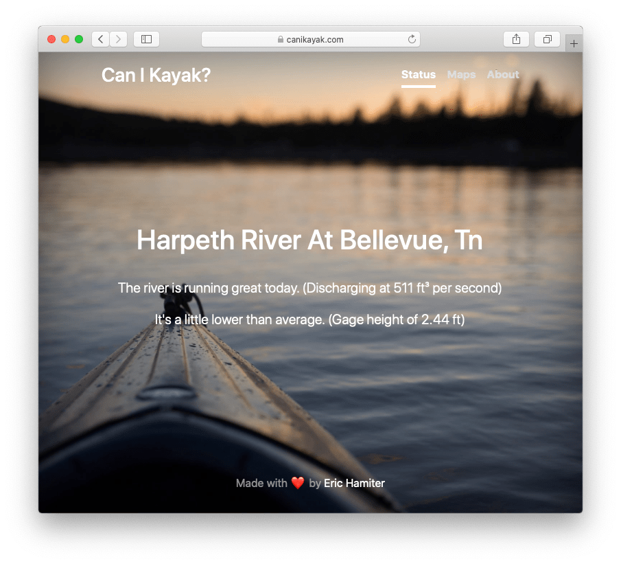

# canikayakjs
Can I Kayak (the Harpeth River in Tennessee, Generally)?

_This is a JavaScript version of [my original implentation written in Python/Flask](https://github.com/ehamiter/canikayak)_

Basically, I wanted a quick and convenient way to check on water levels on a river that I frequently kayak near my house, the Harpeth River, in Tennessee. I realize that this is probably only useful to literally dozens of people, but it's tricky to factor in all statistics that go into making these very non-scientific guesstimates based on the cubic feet of discharged water per second, coupled with gage height.

If you want to modify this for your own use, you can [look up Site Numbers at the USGS here](https://waterdata.usgs.gov/nwis/inventory). Keep in mind it has to have gage and discharge data, and even then, it still may not parse correctly.
